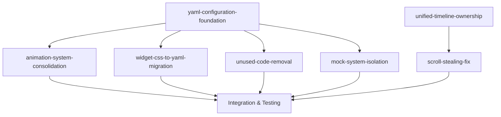

# V3.15 Ledger Series: Configuration-Driven Architecture

**Branch Prefix:** `feat/v3.15-*`
**Focus:** Configuration consolidation and code quality improvements
**Goal:** Enable fine-tuning without code modification by moving hardcoded values to YAML configuration

## Overview

V3.15 addresses architectural debt in V3-minimal by consolidating configuration, removing unused code, and isolating testing infrastructure. The series focuses on moving hardcoded values to YAML configuration to enable tuning without code changes.

## Ledger Dependencies

## Execution Order

### Phase 1: Foundation (Parallel)
1. **yaml-configuration-foundation** - Core infrastructure for YAML-driven configuration
2. **unused-code-removal** - Remove InputProcessor and redundant demos
3. **unified-timeline-ownership** - Resolve architectural conflicts between LiveBlock and Timeline

### Phase 2: System Consolidation (Sequential)
4. **animation-system-consolidation** - Eliminate AnimationRates, consolidate to AnimationClock
5. **mock-system-isolation** - Move mock code to dedicated submodule
6. **scroll-stealing-fix** - Fix scroll behavior during live updates (depends on unified-timeline)

### Phase 3: UI Configuration (Dependent)
7. **widget-css-to-yaml-migration** - Extract CSS values to YAML templates

## Ledger Summaries

### [yaml-configuration-foundation](./yaml-configuration-foundation.md)
**Priority**: Critical (Blocks other ledgers)
**Risk**: Low
**Effort**: Medium

Establishes comprehensive YAML configuration system with validation, hot-reload, and schema definition. Creates foundation for all other configuration-driven improvements.

**Key Deliverables**:
- Enhanced ConfigLoader with validation
- Comprehensive YAML schema design
- Hot-reload capability for development
- Default configuration generation

### [unused-code-removal](./unused-code-removal.md)
**Priority**: High (Reduces complexity)
**Risk**: Low
**Effort**: Low

Removes unused InputProcessor and consolidates redundant demo files to reduce codebase complexity and eliminate conflicting code paths.

**Key Deliverables**:
- Remove unused InputProcessor completely
- Consolidate 7 demos to 3 canonical examples
- Clean up dead imports and references
- 15-20% codebase size reduction

### [animation-system-consolidation](./animation-system-consolidation.md)
**Priority**: High (Eliminates conflicts)
**Risk**: Medium
**Effort**: Medium

Eliminates deprecated AnimationRates wrapper and consolidates all animation timing to YAML-configurable AnimationClock system.

**Key Deliverables**:
- Remove AnimationRates compatibility wrapper
- Migrate all timing to AnimationClock
- YAML-configurable animation speeds
- Environment-based FPS settings

### [mock-system-isolation](./mock-system-isolation.md)
**Priority**: Medium (Code quality)
**Risk**: Medium
**Effort**: High

Isolates 400+ lines of mock simulation code into dedicated submodule to separate testing infrastructure from production code paths.

**Key Deliverables**:
- Clean production LiveBlock class
- Dedicated mock API in `src/mocks/` submodule
- YAML-configurable mock scenarios
- Clear testing/production separation

### [widget-css-to-yaml-migration](./widget-css-to-yaml-migration.md)
**Priority**: Medium (UX improvement)
**Risk**: High
**Effort**: High

Extracts hardcoded CSS values from widget classes to YAML configuration, enabling visual fine-tuning without code changes.

**Key Deliverables**:
- CSS template system with YAML injection
- All widget dimensions configurable
- Hot-reload of visual changes
- Consistent spacing system

### [unified-timeline-ownership](./unified-timeline-ownership.md)
**Priority**: Critical (Architectural fix)
**Risk**: High
**Effort**: High

Resolves fundamental conflict between LiveBlock system and Timeline by establishing clear ownership model and atomic state transitions.

**Key Deliverables**:
- Single source of truth for all blocks
- Clear ownership model with no ambiguity
- Atomic transitions preserving relationships
- Proper state machine for block lifecycle

### [scroll-stealing-fix](./scroll-stealing-fix.md)
**Priority**: High (UX critical)
**Risk**: Medium
**Effort**: Medium

Fixes scroll-stealing behavior where users cannot review timeline history during live updates.

**Key Deliverables**:
- Separate progress vs content update callbacks
- Smart auto-scroll respecting user intent
- Smooth animations without scroll interference
- No timing-based hacks needed

## Success Metrics

### Code Quality
- **Codebase Size**: 15-20% reduction
- **Configuration Coverage**: 90%+ of tunable values in YAML
- **Code Duplication**: Eliminated conflicting systems
- **API Surface**: Reduced by removing mock methods from production classes

### Developer Experience
- **Configuration Changes**: No code modification required for tuning
- **Hot-Reload**: Visual and timing changes visible immediately
- **Testing**: Clear separation between production and testing code
- **Documentation**: All configuration options documented

### Performance
- **Startup Time**: Maintained or improved
- **Animation Smoothness**: Consistent 60fps in production
- **Test Speed**: Faster execution with optimized timing
- **Memory Usage**: Reduced overhead from eliminated duplicate systems

## Risk Assessment

### Low Risk (Can execute immediately)
- yaml-configuration-foundation (additive infrastructure)
- unused-code-removal (removing confirmed unused code)

### Medium Risk (Requires careful testing)
- animation-system-consolidation (timing-sensitive changes)
- mock-system-isolation (affects test behavior)
- scroll-stealing-fix (UI behavior changes)

### High Risk (Major architectural changes)
- widget-css-to-yaml-migration (CSS template system)
- unified-timeline-ownership (core system redesign)

## Implementation Strategy

### Quick Wins (Week 1)
1. Execute unused-code-removal for immediate complexity reduction
2. Implement yaml-configuration-foundation infrastructure
3. Begin unified-timeline-ownership design

### Core Systems (Week 2-3)
1. Implement unified-timeline-ownership
2. Complete animation system consolidation
3. Execute scroll-stealing-fix (after unified timeline)
4. Implement mock system isolation

### Visual Configuration (Week 4)
1. Execute widget-css-to-yaml-migration
2. Integration testing across all changes
3. Performance validation and optimization

## Validation Approach

### Automated Testing
- **Unit Tests**: Each ledger includes comprehensive test coverage
- **Integration Tests**: Cross-ledger compatibility validation
- **Regression Tests**: Behavior preservation verification
- **Performance Tests**: Timing and resource usage validation

### Manual Validation
- **Visual Consistency**: Before/after appearance comparison
- **Configuration Workflow**: End-to-end tuning process validation
- **Developer Experience**: Configuration change workflow testing
- **Demo Functionality**: All demonstrations work identically

## Post-V3.15 Benefits

### Configuration-Driven Development
- Visual tweaks through YAML editing
- Animation timing adjustments without deployment
- Theme customization through configuration
- Mock scenario tuning for presentations

### Cleaner Architecture
- Single animation system (AnimationClock)
- Separated production and testing concerns
- Eliminated duplicate code paths
- Consistent configuration patterns

### Enhanced Maintainability
- Smaller codebase surface area
- Clear separation of concerns
- Documented configuration schema
- Hot-reload development workflow

---

*This ledger series transforms V3-minimal into a configuration-driven system while eliminating architectural debt and improving code quality.*